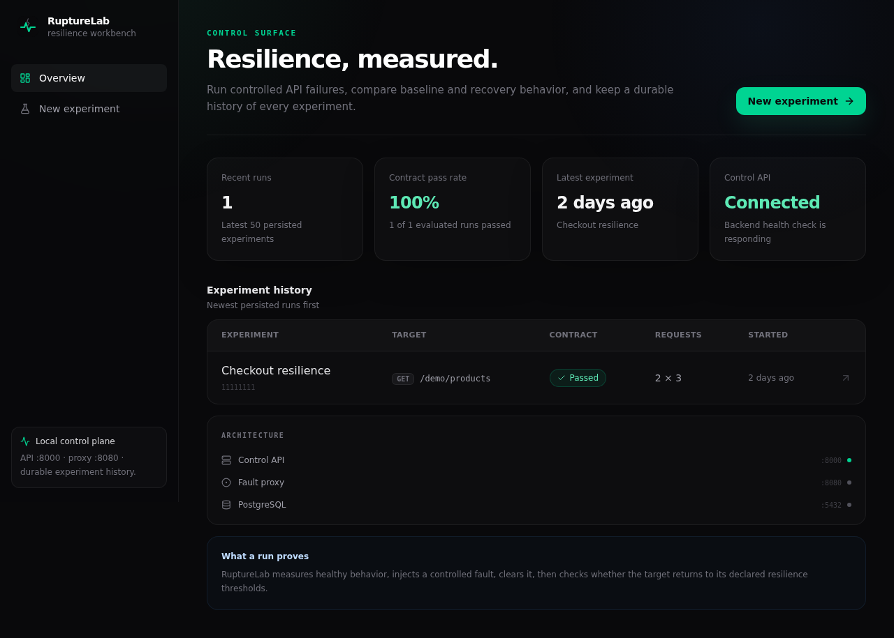
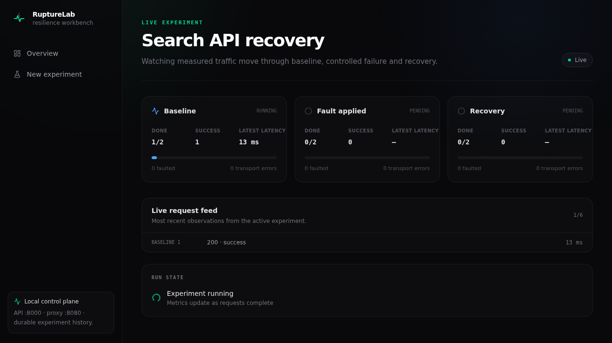
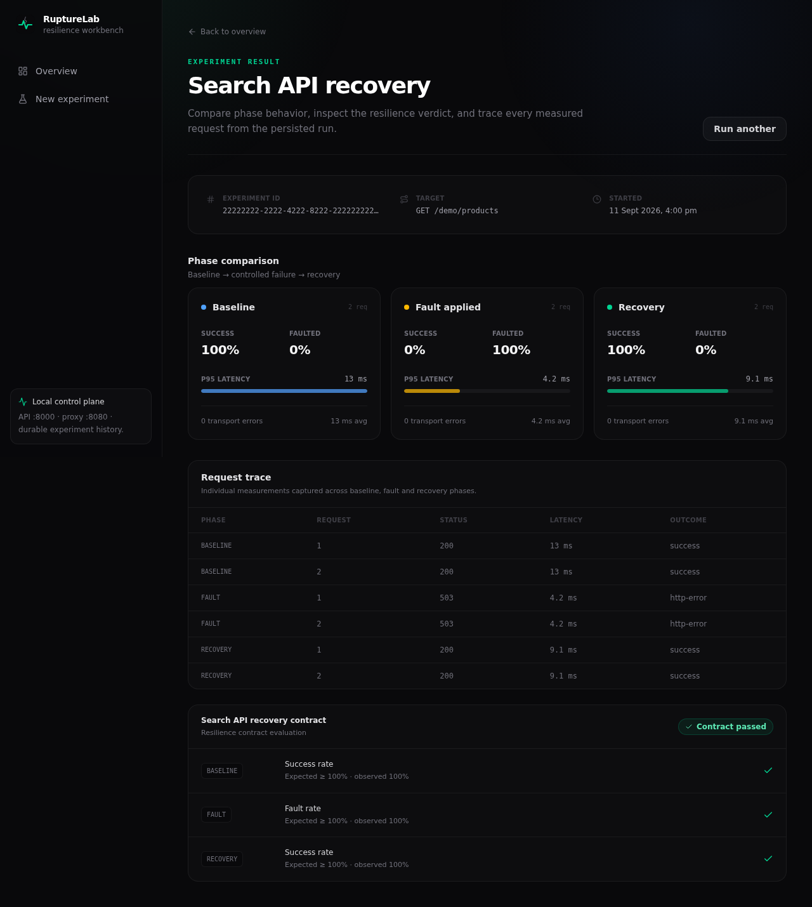
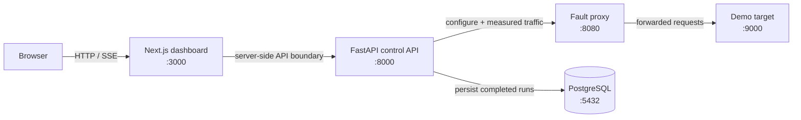

<p align="center">
  
</p>

<h1 align="center">RuptureLab</h1>

<p align="center">
  An API resilience testing workbench that deliberately introduces controlled failures into API traffic, measures how the application behaves, and verifies that it recovers against explicit resilience contracts.
</p>

<p align="center">
  <a href="https://github.com/dkumar315/rupture-lab/actions/workflows/backend-quality.yml"></a>
  <a href="https://github.com/dkumar315/rupture-lab/actions/workflows/frontend-quality.yml"></a>
  <a href="https://github.com/dkumar315/rupture-lab/actions/workflows/system-quality.yml"></a>
  <a href="LICENSE"></a>
</p>

> **Crash-test lab for APIs.** RuptureLab runs traffic through a controllable reverse proxy, establishes a healthy baseline, injects one deliberate fault, clears it, measures recovery, evaluates a declarative contract, streams progress live, and persists the complete run.



## What it does

A resilience experiment has three phases: **baseline**, **fault**, and **recovery**. The same request profile is measured in each phase so the failure period can be compared directly with healthy behavior before and after it.

RuptureLab can inject added latency, HTTP 4xx/5xx responses, post-processing timeouts, or malformed JSON. Faults can be scoped by HTTP method and path prefix and applied probabilistically. Each run records request-level latency, status, transport errors, fault attribution, phase-level success and fault rates, average latency, and p95 latency.

A run can also declare a resilience contract. Contracts can assert minimum success rate, maximum p95 latency, maximum transport errors, and minimum fault rate independently for baseline, fault, and recovery. The final result keeps every individual contract check and its observed value.

## Product flow



The browser starts an experiment through the Next.js server boundary. The FastAPI control plane reserves the single experiment slot, runs the experiment in the background, and publishes sequenced events. The dashboard consumes those events over Server-Sent Events, reconstructs missed progress with `Last-Event-ID`, and falls back to the persisted result if a stream is interrupted after completion.

Once the run finishes, PostgreSQL keeps the experiment specification, all three phase summaries, every request measurement, and every contract check.



## Architecture



The control API and proxy are separate deliberately: the experiment runner owns orchestration and measurement, while the proxy owns traffic manipulation. The target therefore sees ordinary HTTP traffic and does not need RuptureLab-specific code.

For the full component model, event lifecycle, persistence model, invariants, and trade-offs, see [docs/architecture.md](docs/architecture.md).

## Quick start

The recommended path is Docker Compose. You need Docker with Compose v2 and `openssl` available in your shell.

```bash
git clone https://github.com/dkumar315/rupture-lab.git
cd rupture-lab

password="$(openssl rand -hex 24)"
{
  printf 'RUPTURELAB_DB_PASSWORD=%s\n' "$password"
  printf 'RUPTURELAB_DATABASE_URL=postgresql+asyncpg://rupturelab:%s@postgres:5432/rupturelab\n' "$password"
} > .env
unset password

docker compose up --build -d --wait
```

Then open:

- Dashboard: `http://localhost:3000`
- Control API docs: `http://localhost:8000/docs`
- API liveness: `http://localhost:8000/health`
- Dependency readiness: `http://localhost:8000/ready`

The Compose stack publishes application ports on loopback only. PostgreSQL remains internal to the Compose network.

To stop the stack without deleting experiment history:

```bash
docker compose down
```

To remove the local PostgreSQL volume as well:

```bash
docker compose down -v
```

## Example experiment

The dashboard ships with a useful default against the deterministic demo target:

```text
GET /demo/products
5 requests per phase
100 ms between requests
100% HTTP 503 fault injection
baseline success ≥ 100%
fault rate ≥ 100%
recovery success ≥ 100%
```

That produces 15 measured requests across baseline, fault, and recovery and a three-check contract evaluation.

For a short product walkthrough, see [docs/demo.md](docs/demo.md).

## Fault model

| Mode | Proxy behavior |
| --- | --- |
| Added latency | Delays the matched request and forwards the real upstream response |
| HTTP error | Returns the configured 4xx/5xx response without forwarding the request |
| Timeout | Lets the upstream process the request, then delays and returns HTTP 504 |
| Malformed JSON | Forwards upstream processing, then replaces the response body with malformed JSON |

Fault profiles also support HTTP method filters, path-prefix matching, probability from `0.0` to `1.0`, and up to 30 seconds of configured latency/timeout delay. Experiment request targets must stay on the configured proxy origin; query strings are supported, while authority-like paths, fragments, dot segments, and the reserved `/_rupturelab` control namespace are rejected.

## Resilience contracts

Contracts are phase-specific and may combine any of these checks:

| Check | Operator |
| --- | --- |
| Minimum success rate | `≥` |
| Maximum p95 latency | `≤` |
| Maximum transport errors | `≤` |
| Minimum fault rate | `≥` |

A contract passes only when every configured check passes.

## Reliability and quality gates

RuptureLab is validated at three levels:

| Layer | Current v1.0 gate |
| --- | --- |
| Backend | 108 tests; strict mypy; Ruff; Alembic upgrade/check/downgrade; pip dependency audit; 100% line and branch coverage across the `rupturelab` package |
| Frontend | 53 unit/component tests; strict TypeScript; ESLint; Prettier; npm production audit; 100% statement/branch/function/line coverage across project-owned frontend logic; 5 Chromium flows |
| System | Production Compose build; five healthy services; restart and persistence smoke checks; overlapping-run protection; non-root container checks; real Chromium run through Next.js → API → proxy → target → PostgreSQL |

GitHub Actions runs the same three pipelines on every pull request and push to `main`: **Backend Quality**, **Frontend Quality**, and **System Quality**.

## Runtime hardening

The production-style Compose stack includes non-root application containers, dropped Linux capabilities, `no-new-privileges`, read-only backend filesystems, localhost-only published ports, dependency-aware health checks, automatic Alembic migration on API startup, a durable PostgreSQL named volume, and security headers from the Next.js frontend.

`GET /health` answers whether the control API process is alive. `GET /ready` is stricter and returns `503` unless both PostgreSQL and the fault proxy are reachable.

## Repository layout

```text
.
├── backend/                  FastAPI control API, proxy, demo target and tests
│   ├── alembic/              PostgreSQL schema migrations
│   ├── src/rupturelab/
│   │   ├── api/              experiment and system routes
│   │   ├── contracts/        declarative contract evaluation
│   │   ├── db/               SQLAlchemy persistence layer
│   │   ├── demo_target/      deterministic API used for demonstrations
│   │   ├── experiments/      orchestration, metrics and SSE event broker
│   │   ├── faults/           fault profiles and matching engine
│   │   └── proxy/            transparent reverse proxy + control namespace
│   └── tests/
├── frontend/                 Next.js dashboard and browser tests
├── docs/                     architecture and demo documentation
├── scripts/system-smoke.sh   restart, concurrency and persistence proof
└── compose.yaml              production-style local stack
```

## Development

Backend tooling targets Python **3.14.7**. Frontend tooling targets Node.js **26.8.2** with npm **12.0.2**.

Backend:

```bash
cd backend
python -m venv .venv
source .venv/bin/activate
python -m pip install -e '.[dev]'
python -m ruff format --check .
python -m ruff check .
python -m mypy src tests
python -m pytest --cov=rupturelab --cov-branch
```

Frontend:

```bash
cd frontend
npm ci
npm run format:check
npm run lint
npm run typecheck
npm run test:coverage
npm run build
npm run test:e2e
```

Full production stack:

```bash
docker compose up -d --wait
./scripts/system-smoke.sh
npm --prefix frontend run test:system
```

## Scope and safety

RuptureLab is designed for local development, test environments, and systems you own or are explicitly authorized to test. The proxy control namespace has no authentication layer and should not be exposed directly to an untrusted network. Experiment headers and request bodies are persisted with completed runs, so use synthetic test values rather than real credentials or sensitive payloads. It is a resilience experimentation tool, not a load-testing platform, service mesh, or production traffic-management system.

See [SECURITY.md](SECURITY.md) for the operational security model.

## License

Released under the [MIT License](LICENSE).
