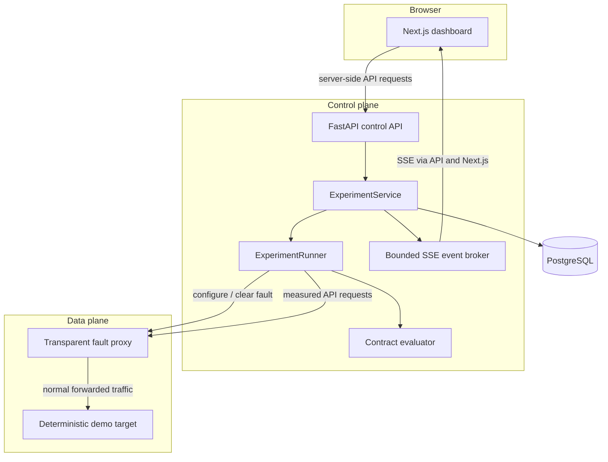
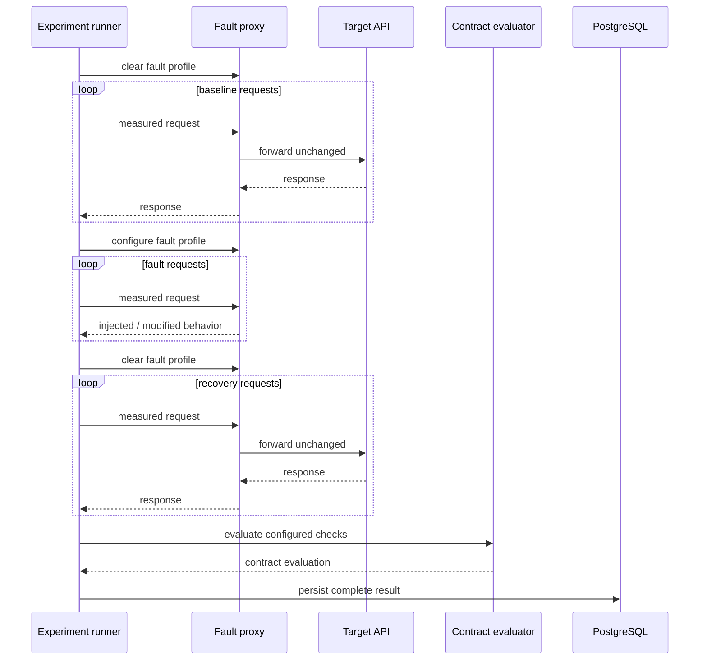

# RuptureLab architecture

RuptureLab separates experiment orchestration from traffic manipulation. The control API decides **what to run and what to measure**; the fault proxy decides **how matched traffic should be disrupted**. That split keeps the target API unaware of RuptureLab and makes the measurement path explicit.

## Component model



### Next.js dashboard

The browser talks to same-origin Next.js routes. Those server routes call the FastAPI control API, so the browser does not need direct cross-origin access to the backend. The dashboard provides experiment configuration, persisted history, live progress, per-phase metrics, request-level observations, and contract results.

### FastAPI control API

The control API owns experiment lifecycle and persistence. It exposes synchronous and background experiment execution, persisted history, SSE streams, liveness, and readiness.

Key routes:

| Method | Route | Purpose |
| --- | --- | --- |
| `GET` | `/health` | process liveness |
| `GET` | `/ready` | PostgreSQL + proxy readiness |
| `POST` | `/experiments/run` | synchronous experiment |
| `POST` | `/experiments/start` | reserve runner and start background experiment |
| `GET` | `/experiments/{id}/events` | sequenced Server-Sent Events |
| `GET` | `/experiments` | persisted experiment summaries |
| `GET` | `/experiments/{id}` | complete persisted result |

### Experiment service

`ExperimentService` owns the global experiment lock, background tasks, event streams, and persistence boundary. RuptureLab deliberately permits only one active experiment per control-plane instance because the current proxy has one mutable fault profile. A concurrent start attempt returns HTTP `409` rather than risking one experiment changing another experiment's fault state.

### Experiment runner

Every run follows the same sequence:



The fault profile is cleared before baseline and again in a `finally` path after the fault phase. Recovery is therefore measured with the proxy returned to its normal state even if fault-phase execution raises while cleaning up.

### Fault proxy

The proxy forwards ordinary HTTP methods to the configured upstream target and reserves `/_rupturelab/*` for its own control plane. Experiment request targets are restricted to local origin-form paths so a run cannot replace the configured proxy authority. Query strings are supported, while authority-like paths, fragments, dot segments, ambiguous escaping, and the reserved control namespace are rejected. The experiment model also normalizes fault matching to the decoded request path and the selected request method so query-bearing targets still receive the intended fault. The proxy repeats the local-path validation before forwarding as a defense-in-depth boundary.

A `FaultProfile` can match by path prefix, method, and probability. It can then apply added latency plus at most one terminal fault:

- HTTP error: return the configured `400–599` status without calling upstream.
- Timeout: allow upstream processing, wait the configured duration, then return `504`.
- Malformed JSON: allow upstream processing, then replace the body with deliberately invalid JSON.
- Latency-only: delay the request and return the real upstream response.

Injected responses carry `X-RuptureLab-Fault` and `X-RuptureLab-Latency-Ms`, which lets the experiment runner distinguish deliberate faults from unrelated transport failures.

### Deterministic demo target

The included target provides products, orders, an echo route, statistics, reset behavior, and idempotency-key handling. It gives RuptureLab a reproducible API to exercise without depending on an external service.

## Live event lifecycle

Background experiments publish typed events in order:

```text
experiment.started
phase.started
request.completed ...
phase.completed
phase.started
request.completed ...
phase.completed
phase.started
request.completed ...
phase.completed
contract.evaluated      # when a contract is configured
experiment.completed    # only after persistence succeeds
```

Failures publish `experiment.failed` instead.

Each stream receives monotonically increasing sequence numbers. The browser's native `EventSource` reconnect behavior sends `Last-Event-ID`; the API replays retained events with greater sequence numbers. A 15-second SSE heartbeat prevents an otherwise idle connection from appearing dead to intermediaries.

The in-memory broker is intentionally bounded to **32 streams × 512 events**. A run is capped at 100 requests per phase, so 512 events is sufficient to retain a complete maximum-size run while preventing unbounded process memory growth. When stream capacity is full, completed streams are evicted before active streams.

Live event retention is not the source of truth. PostgreSQL is. If the stream becomes unavailable after the run has been persisted, the frontend probes the result endpoint and transitions to the durable result.

## Measurements and contracts

Every request records:

- status code, when available
- elapsed duration in milliseconds
- success/failure classification
- injected-fault marker
- transport error type, when present

Each phase then derives request count, successful/failed requests, transport errors, faulted requests, status-code counts, average latency, and p95 latency.

A resilience contract may define checks independently for baseline, fault, and recovery. Supported metrics are success rate, p95 latency, transport errors, and fault rate. Every check is stored with its expected value, observed value, comparison operator, and pass/fail outcome.

## Persistence model

PostgreSQL stores one normalized experiment graph:

```text
experiment_runs
├── phase_results          3 rows per completed run
├── request_measurements   N rows for every measured request
└── contract_checks        one row per configured contract assertion
```

The original validated experiment specification is also stored with the run so a persisted result can reconstruct the exact request, fault, and contract configuration. That includes request headers and JSON bodies, so the workbench is intended for synthetic test data rather than real secrets or sensitive payloads.

Alembic owns schema migration. In Compose, the control API runs `alembic upgrade head` before starting Uvicorn.

## Health and readiness

The two system endpoints answer different questions:

- `/health` — is the API process alive?
- `/ready` — can the API reach both PostgreSQL and the fault proxy?

Compose uses dependency-aware health checks so the target starts before the proxy, PostgreSQL and proxy are healthy before the control API, and the control API is ready before the frontend is considered ready.

## Runtime security model

The Compose deployment is hardened for a local/test workbench rather than presented as an internet-facing multi-tenant service:

- application containers run as non-root users
- Linux capabilities are dropped
- `no-new-privileges` is enabled
- backend filesystems are read-only with a temporary `/tmp`
- host-published ports bind to `127.0.0.1`
- PostgreSQL is not published to the host
- the frontend removes the framework signature header and sets defensive browser headers
- local database credentials live in ignored `.env` files; CI generates ephemeral credentials at runtime
- Python and npm production dependencies are audited in CI

The proxy control namespace itself is not authenticated. Exposing it to untrusted networks is outside the v1.0 threat model.

## Design decisions and trade-offs

### SSE instead of WebSockets

Live experiment progress is primarily server-to-client. SSE keeps the protocol HTTP-native, works with browser reconnect semantics, exposes `Last-Event-ID`, and avoids a bidirectional socket layer the product does not need.

### One active experiment per instance

The proxy owns one mutable fault profile, so global serialization is a correctness constraint rather than an arbitrary limit. A future multi-tenant design would isolate a proxy/fault state per run instead of weakening that invariant.

### In-memory live events, durable completed results

SSE events are transient progress information. PostgreSQL is the durable state. This keeps the live path small while ensuring completed experiments survive API and full-stack restarts.

### Deterministic local target

A built-in target makes the project reproducible and lets system tests prove the entire data path without depending on a third-party service. The proxy can still point at another HTTP target in a controlled environment.

## What v1.0 deliberately does not include

RuptureLab v1.0 is not a distributed load generator, service mesh, chaos platform, or internet-facing multi-user service. It deliberately avoids Redis, queues, Kubernetes, Prometheus/Grafana, and a durable event bus because none are required to demonstrate the core resilience workflow correctly.

Those would become justified only if the product needed horizontal experiment concurrency, multi-user isolation, distributed workers, or long-term observability beyond persisted experiment results.
